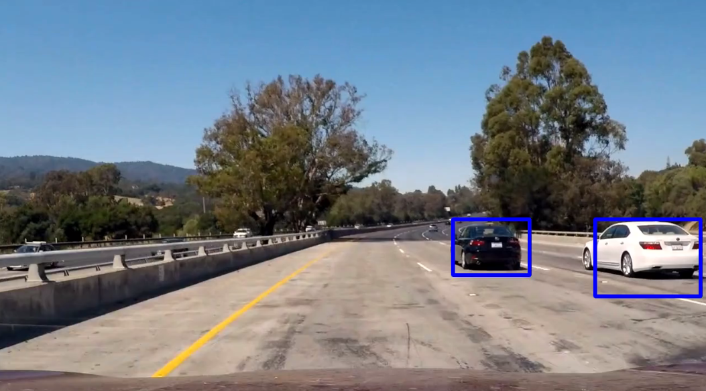
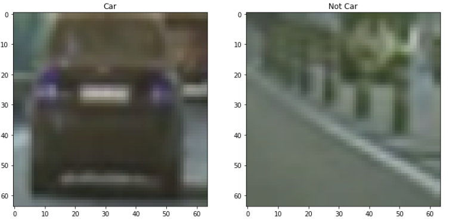
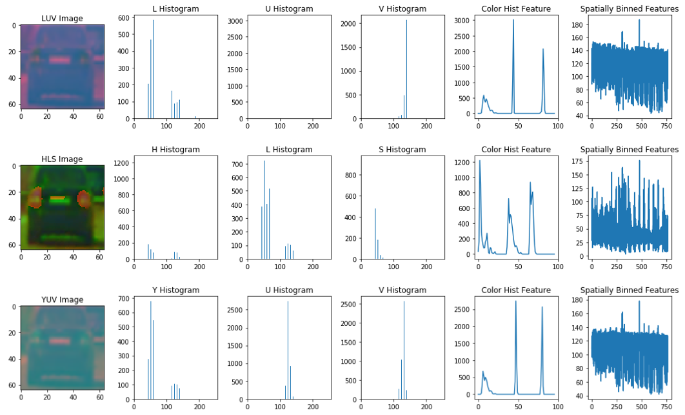
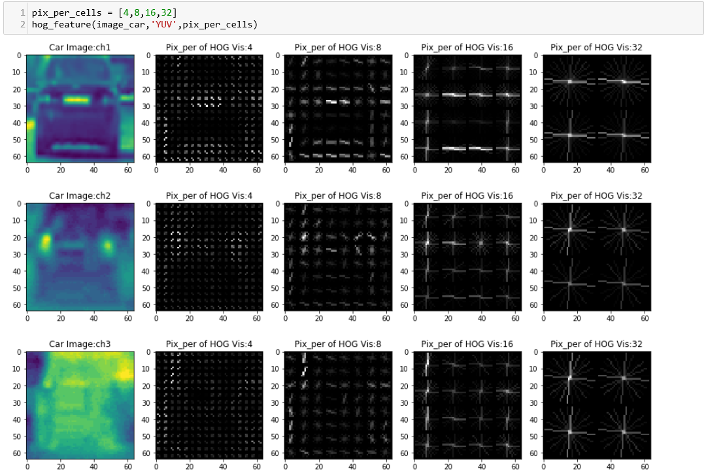
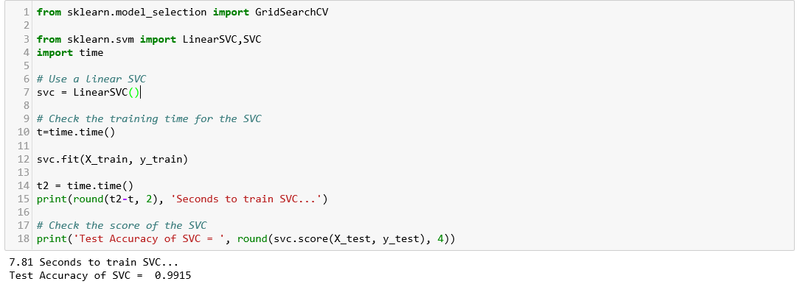
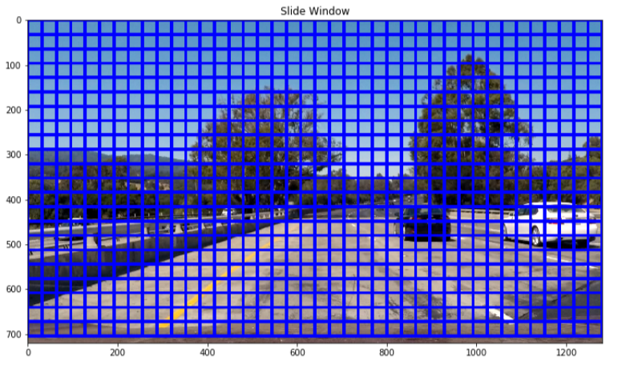
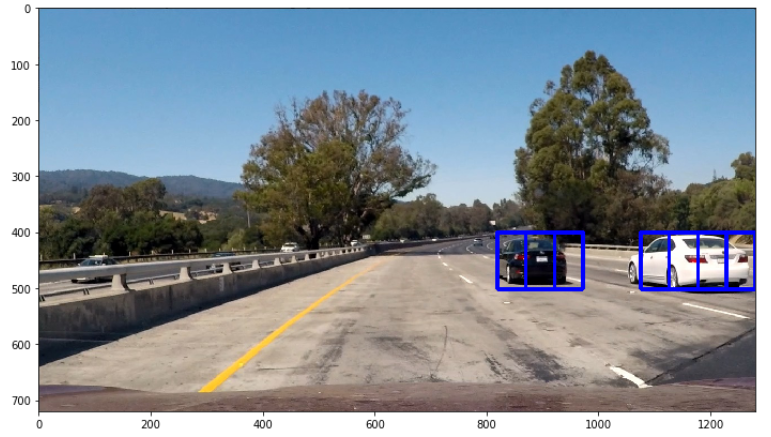
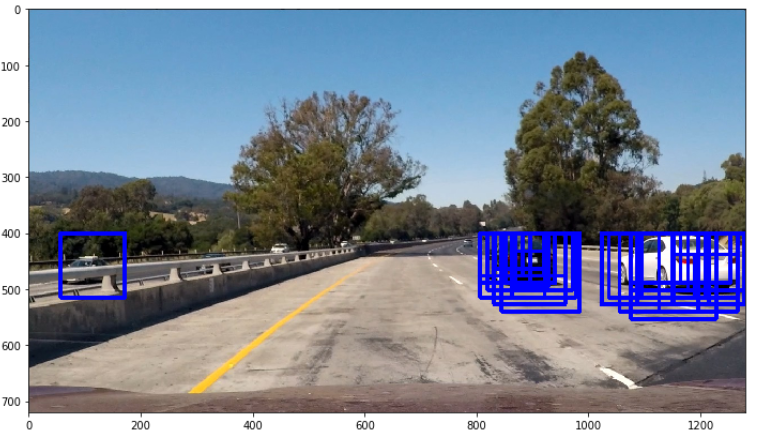

# Vehicle Detection And Tracking

Self-Driving Car NanoDegree

## Overview

In this project, our goal is to write a software pipeline to detect vehicles in a video (start with the test_video.mp4 and later implement on full project_video.mp4), but the main output or product we want to create is a detailed writeup of the project.

The goals / steps of this project are the following:

* Apply a color transform and append binned color features
* Perform a Histogram of Oriented Gradients (HOG) feature extraction on a labeled training set of images and train a classifier Linear SVM classifier
* Note: for those first two steps don't forget to normalize your features and randomize a selection for training and testing.
* Implement a sliding-window technique and use your trained classifier to search for vehicles in images.
* Run your pipeline on a video stream (start with the test_video.mp4 and later implement on full project_video.mp4) and create a heat map of recurring detections frame by frame to reject outliers and follow detected vehicles.
* Estimate a bounding box for vehicles detected.

Here are links to the labeled data for [vehicle](https://s3.amazonaws.com/udacity-sdc/Vehicle_Tracking/vehicles.zip) and [non-vehicle](https://s3.amazonaws.com/udacity-sdc/Vehicle_Tracking/non-vehicles.zip) examples to train our classifier.  These example images come from a combination of the [GTI vehicle image database](http://www.gti.ssr.upm.es/data/Vehicle_database.html), the [KITTI vision benchmark suite](http://www.cvlibs.net/datasets/kitti/), and examples extracted from the project video itself.We can also take advantage of the recently released [Udacity labeled dataset](https://github.com/udacity/self-driving-car/tree/master/annotations) to augment our training data.  

## Writeup

### Step 1: Color Histogram

Apply a color transform and append binned color features :

* Load the labeled data of [vehichle](https://s3.amazonaws.com/udacity-sdc/Vehicle_Tracking/vehicles.zip) and [non-vehichle](https://s3.amazonaws.com/udacity-sdc/Vehicle_Tracking/non-vehicles.zip) examples

* Choose one color space from RGB, HSV,LUV,HLS,YUV,YCrCb color space.
* Compute color histogram features
* Use cv2.resize().ravel() to create the feature vector

### Step 2: Histogram of Oriented Gradients (HOG)  

Perform a Histogram of Oriented Gradients (HOG) feature extraction on a labeled training set of images:

* Choose one color space from RGB, HSV,LUV,HLS,YUV,YCrCb color space.
* Separate color channels from color space
* Use skimage.feature.hog() to extract HOG feature
* Adjust the values of cells_per_block and orient(typical values are between 6 and 12 bins)

* Append color histogram features , spatial features and HOG features to features list
* Extract the feature vectors of vehichle and non-vehichle data set
* Split up data into randomized training and test sets
* Use sklearn.preprocessing.StandardScaler() to normalize the features,and apply the scaler to training and test data sets

### Step 3: Building and Training Classifier

Use LinearSVC as the classifier :

### Step 4: Sliding Window and search for vehicles

Implement a sliding-window technique and use your trained classifier to search for vehicles in images :

* Decide what size window you want to search
* Decide where in the image you want to start and stop your search
* Decide how much you want windows to overlap
* Get a list of windows to search for vehicles

* Iterate over all windows in the list
* Extract features for each window
* Scale extracted features
* Use trained classifier to predict
* Save the windows for positive detections

### Step 5: Multiple Detections

* Use multi-scale windows to search for car
* Adjust the positions of start and stop to search

* Add heat to each box in box list,where a positive detection is predicted by SVC
* Apply threshold to remove false positives
* Use scipy.ndimage.measurements.label() to find final boxes from heatmap 

